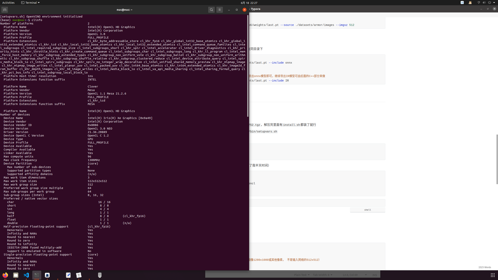
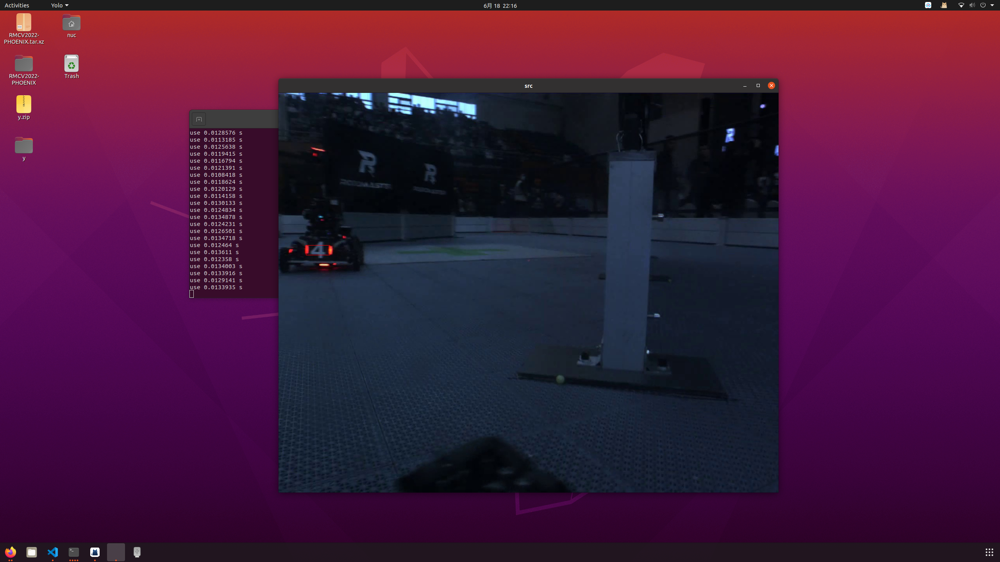
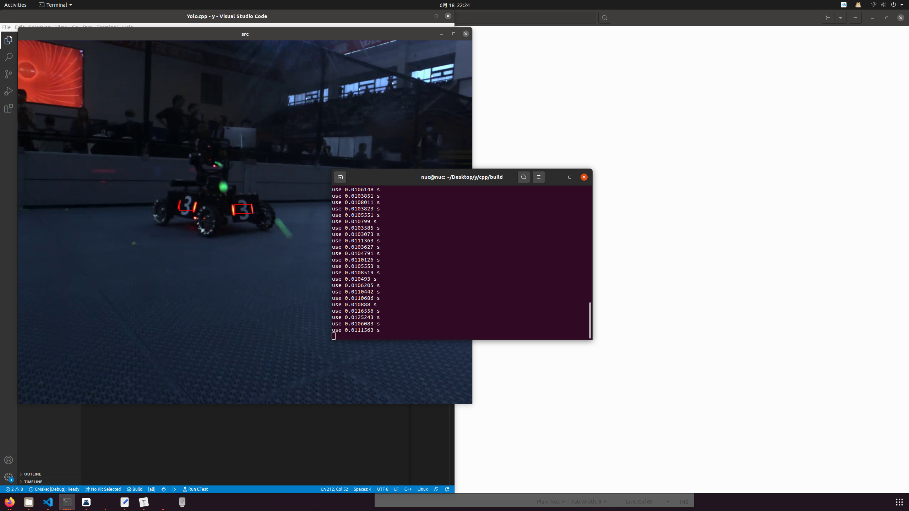

<center> ALL of Yolov5

# result

|   PC    |   Device    | Models  |  Input  | 剪枝 |  加速   | Openvino |      Language       | Time(ms)（平均） |
| :-----: | :---------: | :-----: | :-----: | :--: | :-----: | :------: | :-----------------: | :--------------: |
| rleaves | CPU(9代i5)  | yolov5n | 512x512 |  否  |   否    |    否    |    Python(torch)    |        30        |
|         |             |         |         |  否  |  onnx   |    否    | Python(onnxruntime) |        15        |
|         |             |         |         |  是  |   否    |    否    |    python(torch)    |  忘了（没记录）  |
|         |             |         |         |  是  |  onnx   |    否    | python(onnxruntime) |        12        |
|   NUC   | CPU(11代i7) | yolov5n | 512x512 |  否  |   否    |    否    |    Python(torch)    |        24        |
|         |             |         |         |  否  |  onnx   |    否    | Python(onnxruntime) |        18        |
|         |             |         |         |  是  |   否    |    否    |    python(torch)    |        15        |
|         |             |         |         |  是  |  onnx   |    否    | python(onnxruntime) |       12.5       |
|         |             |         |         |  否  | IR(CPU) |    是    |         C++         |        16        |
|         |             |         |         |  是  | IR(CPU) |    是    |         C++         |       12.5       |
|         |             |         |         |  否  | IR(GPU) |    是    |         C++         |        13        |
| Finally |   Finally   | Finally | Finally |  是  | IR(GPU) |    是    |         C++         |  11.5(80-90帧)   |

综上：

1. ONNX/IR 模型加速，加速50%
2. 剪枝，随缘变快，在 1 的基础上快20%左右
3. openvion GPU核显加速，在1，2的基础上快5% - 10%

4. 其他：C++推理代码做了细节处理，快了1,2,3的基础上快了1ms

备注：

1. yolov5s网路暂时没有测试，别问，问就是我电脑训不动。。这几天电脑快宕机了


# 关于代码

## Python（训练）

### 环境配置

1. 先装miniconda（tools文件夹里有）`bash Miniconda3-latest-Linux-x86_64.sh`
2. `conda create -n yolo python=3.6`
3. `conda activate yolo`
4. `pip install -r requirements.txt`
5. 剩下的跑代码缺什么装什么


## 关于数据集的准备

> Armor 数据集放在 ./python/datasets/armor 文件夹下的images 和 labels文件夹里，Buff同

- BUFF

  没什么想法

- Armor

 1. 执行脚本1：把视频帧转化为图片（如果已经有图片数据可跳过此步骤）

    - 进脚本修改视频路径
    - 输出的图像在脚本文件夹下(./tools)的images文件夹中

    ```shell
    python av2image.py
    ```

2. Tools 文件夹里有一个上交开源的自动标数据集的`LabelRoboMaster`，进去编译完会有一个可执行文件，可视化全自动标注

3. 在终端把上面标注出来的.txt文件（也在images文件夹里）移动到同文件夹下的sj_labels文件夹中

```shell
mv *.txt ../sj_labels/
```

4. 执行脚本2：把上交数据格式label转化为yolo数据格式，生成结果在同文件夹下labels文件夹中

```shell
python sj2label.py
```

5. 执行脚本3：把没有label的图像删掉

```shell
python delete.py	
```


### 训练过程

1. 原生训练（作为参照物）

```shell
python train.py --weights ./weights/yolov5n.pt --cfg ./models/yolov5n.yaml --data ./data/armor.yaml --epochs 100 --imgsz 512 --batch-size 20 --adam
```

2. 稀疏训练

备注：

- 设置稀疏率 sr 下面的值可以不动
- 训练结果和原生训练数据对比一下（精确率P，召回率R，和两个Map），数据差不多就行，差太多调整稀疏率（应该不会有问题，我已经跑过一次了）
- 训练曲线应该是：P先降后升，R和Map一直升

```shell
python train_sparity.py  --sr 0.0001  --weights ./ --data ./data/armor.yaml  --epochs 99  --batch-size 20  --imgsz 512 --adam
```

3. 剪枝！ 

备注：

- 注意修改exp后面的数字，是2中稀疏训练出来的模型，percent是剪枝率
- 这一步执行完之后该目录会出现一个pruned_model.pt用于下一步finetune

```shell
python prune.py  --percent 0.8  --weights runs/train/exp6/weights/last.pt  --data data/armor.yaml  --cfg models/yolov5n.yaml
```

	4. Train from scratch

备注：

- 这一步训练会特别特别特别特别特别特别特别特别慢！因为是从头训练的
- P,R,Map这些数据指标会升的特别慢，要有点耐心。。。。
- 如果第二个epoch结束P,R,Map还是0，转头，看看是不是什么参数输错了

```shell
python finetune_pruned.py  --weights pruned_model.pt  --data data/armor.yaml  --epochs 100  --imgsz 512 --epochs 100 --batch-size 20 --adam
```

- 以上，三次训练的结果指标都是无损的，那最后这个模型就是无损的


- 测试模型

备注：这里也可以输入.onnx模型

```shell
# 非剪枝模型
python detect.py --weights ./runs/train/exp6/weights/last.pt --source ./datasets/armor/images --imgsz 512

# 剪枝模型
python	detectpruned.py --weights ./runs/train/exp6/weights/last.pt --source ./datasets/armor/images --imgsz 512
```


- 导出模型

备注：导出的IR模型有`bin`和`xml`两个文件，这两个一定要放在同目录下

```shell
# 直接导出为onnx模型
python export.py --weights ./runs/train/exp6/weights/last.pt --include onnx

# 直接导出为IR模型
# 备注：如果你的代码在这里导出IR模型报错了，那么执行上一步导出onnx模型即可，继续导出IR模型可由后面的C++部分来做
python export.py --weights ./runs/train/exp6/weights/last.pt --include IR
```


## C++（部署）

### 环境配置

（可放心食用，我已经踩了很多坑）

1. `Tools`文件夹里有一个`l_openvino_toolkit_p_2021.4.752.tgz`，解压完里面有`install.sh`都装了就行

2. 在`~/.bashrc`加上 `source /opt/intel/openvino_2021/bin/setupvars.sh`

3. 环境脚本

   ```shell
   cd /opt/intel/openvino_2021/install_dependencies
   sudo -E ./install_openvino_dependencies.sh
   sudo -E ./install_NEO_OCL_dirver.sh 	# 这个是CPU核显驱动
   
   cd /opt/intel/openvino_2021/deployment_tools/model_optimizer/install_prerequisites
   sudo ./install_prerequisites.sh
   ```

4. `Tools`文件夹里有一个`openvino.conf`文件

   ```shell
   # 这个是手动加的，要不然编译代码会报错
   sudo mv openvino.conf /etc/ld.so.conf.d
   sudo ldconfig
   ```

5. 这一步比较重要，关乎到能不能用CPU核显(GPU)加速（卡了我半天时间）

```shell
sudo apt install clinfo

sudo add-apt-repository ppa:intel-opencl/intel-opencl
sudo apt update
sudo apt install intel-opencl-icd

# 这里可能会装不上，不管翻不翻墙，报错失败以后会给一个链接，wget下来dpkg装就好了
```

```shell
# 终端输出 差不多这样就Ok了
clinfo
```




### IR模型导出

```shell
# ONNX 转 IR
cd /opt/intel/openvino_2021/deployment_tools/model_optimizer

python mo_onnx.py  --input_model *.onnx \
                    --output_dir ./ \
                    --input_shape [1,3,512,512] \
                    --data_type FP16
```


### 代码

备注：启动CPU核显要10S左右把。。。

部署代码的时候需要知道这么几个地方：

1. `Yolo`里的`object`结构体和核心接口

```c++
typedef struct {
    float prob;			// 识别准确率
    int id;				// 物体属于哪一类
    cv::Rect rect;		// 识别物体框（这个框对应原生图像1280x1080或其他像素， 不是输入网络的512x512）
} Object;

// 检测函数返回的是这个结构体的向量
// Tips:通过这个返回值可以记录该帧所有的敌方单位，比如2号，3号，可配合操作手通信做集火操作，顺便的，也可以做一个防抖层
bool Process(const cv::Mat& src,std::vector<Object> &objects);
```

2.  部署需要改的参（Yolo类里的）

```C++
std::string _input_model; 			// 训练好的模型位置 
size_t _n_class;					// 分的类num，装甲板是36
size_t _imgsz;						// 输入网络图像的大小，这里是512x512
double _cof_threshold;              // 置信度阈值,计算方法是框置信度乘以物品种类置信度，小于该值会被过滤，这里设0.4
double _nms_area_threshold;         // nms最小重叠面积阈值(框和框之间的重叠面积)，这里设0.1
bool _use_gpu;						// 是否使用CPU核显加速
```

3. 输出图像

```C++
// 这里的第二个参可配合1食用
static void Draw(cv::Mat& src, std::vector<Object> detected_objects);
```

4. 关于输出的类（即上面结构体的id）

​		这个和python训练代码里`data/armor.yaml`的分类是保持一致的，这里再写一遍

​		总共有36个类，id 为 0 - 35

|       颜色       | B（蓝色） | R（红色） | N（熄灭） | P（紫色） |
| :--------------: | :-------: | :-------: | :-------: | :-------: |
|    G（哨兵）     |     0     |     9     |    18     |    27     |
|    1（一号）     |     1     |    10     |    19     |    28     |
|    2（二号）     |     2     |    11     |    20     |    29     |
|    3（三号）     |     3     |    12     |    21     |    30     |
|    4（四号）     |     4     |    13     |    22     |    31     |
|    5（五号）     |     5     |    14     |    23     |    32     |
|   O（前哨站）    |     6     |    15     |    24     |    33     |
|    Bs（基地）    |     7     |    16     |    25     |    34     |
| Bb（基地大装甲） |     8     |    17     |    26     |    35     |

5. demo

   

   